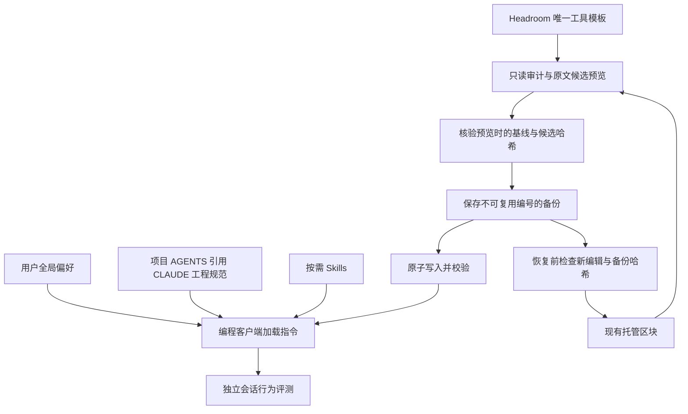

# Headroom 指令治理改造

状态：工程改造与本地同步完成；行为 A/B 为 NOT_TESTABLE，未宣称模型行为无回归。最终证据见 `instruction-governance-acceptance.md`。

## 目标与边界

将全局行为偏好、项目规范、工具使用提示、运行时配置和评测分开管理。
保留现有未提交修改，不变更模型、权限、认证、路由或用户自有规则。
本计划是本次变更的事实源，不初始化另一套规格工具。

## 结构与所有权

| 层 | 事实源 | 责任 |
|---|---|---|
| 全局偏好 | 用户全局 AGENTS.md 的非托管内容 | 跨项目行为；用户维护 |
| 项目规范 | 项目 AGENTS.md 引用 CLAUDE.md | 工程约束、测试命令、兼容性 |
| 工具提示 | Headroom 模板 | 短提示、适用条件、原文读取例外 |
| 工程方法 | 已有 Skills | 按需加载，不复制完整 SOP |
| 运行时 | 客户端支持的配置和接口 | 模型、权限、会话与子 Agent |
| 治理 | Headroom 审计与候选操作 | 来源、差异、备份、校验和恢复 |
| 行为验证 | 隔离会话评测 | 同条件比较，保存真实证据 |

## 验收任务

- [x] P1 保存当前 MD 和相关配置的基线哈希；记录原有工作区修改。
- [x] P2 为每个托管提示建立唯一模板来源，修正命令路径引用、原文例外、文档版式适用范围和工具可用性要求。
- [x] P3 逐模板测试生成、路径含空格、重复应用、移除、用户内容保护及错误行为；先暴露缺陷再修复。
- [x] P4 更新项目 AGENTS.md 和架构文档；备份后同步本机已有托管块，保留用户非托管内容及其他配置。
- [x] P5 实现只读指令审计：规则来源、托管块状态、重复/冲突提示和候选差异；不自动重写用户全文。
- [x] P6 实现候选生命周期：预览、基线/候选哈希、备份、应用前冲突检测、恢复与恢复校验；正式采用与测试分开。
- [x] P7 建立 T1-T8 评测协议及结果记录；可观测的真实会话证据与静态检查分开，不能运行的项目标注 NOT_TESTABLE。
- [x] P8 执行相关 Rust、前端及集成验证，核对所有模板和本地落盘内容，提供结果与剩余限制。

## 验证标准

模板测试验证确定性生成和安全文件操作；行为测试验证指定场景，不能宣称普遍无损。
T1 简单直接任务；T2 已授权持续执行；T3 显式要求的真实只读子 Agent；
T4 重叠写入串行/所有权；T5 正式流程来源；T6 按范围测试；
T7 未授权最终发布边界；T8 明确任务与通用技能冲突。

行为 A/B 使用相同模型、工具、权限、项目快照和输入，分别新建隔离会话。
如宿主缺少隔离或证据接口，报告能力缺口，不临时替换正在使用的全局配置冒充隔离。
文件恢复使用字节哈希验证；会话加载状态需要独立证据。

## 不纳入本次改造

账号云同步、替代宿主的 Agent 调度/沙箱、安装新的规格体系、自动改写用户记忆。
这些能力不是修改 Markdown 的自然结果。

## 证据记录

每阶段记录命令、退出状态、覆盖范围与失败原因。未完成项保持未勾选。

### 第一阶段进展

- 基线存放于 `.local-test/instruction-governance/20260916-224026/manifest.json`；配置仅记录哈希，不复制认证内容。
- 项目入口已改为引用 CLAUDE.md；架构文档已修正失效文件引用和 RTK 必需描述。
- 路径引号/文档版式边界回归测试：修复前失败于 `quote executable paths`；修复后 1 passed。
- 四个托管模板的生成、备份、重复应用、移除及用户内容保护测试通过；`cargo test --manifest-path src-tauri/Cargo.toml --lib instruction_templates_`：2 passed，覆盖四个模板。
- 本机全局托管块尚未更新；候选审计、生命周期及真实行为评测尚未完成。

### 第二阶段进展

- 已增加 `instruction_governance.rs`，设置页审计面板及共用后端的 `instruction-audit` CLI。
- 只读审计仅刷新现有托管块；重复/残缺标记阻止应用；候选绑定基线和模板哈希。
- UUID 备份保存基线与候选；恢复核验备份哈希并拒绝覆盖后续编辑。
- Rust：`cargo test --manifest-path src-tauri/Cargo.toml --lib instruction_`，5 passed。
- 前端：`npx vitest run src/components/InstructionGovernance.test.tsx`，2 passed；`npx tsc --noEmit` 通过。
- CLI 构建成功，现有 dead-code 警告保留。
- 已通过 CLI 同步本机 Codex RTK/MarkItDown 托管块；Serena 和 Claude 文件无需变更。
- 快照 `c44ccf7b-85e0-41db-8bfd-3f91e0857725`；落盘候选哈希一致；Codex config.toml 与 Claude settings.json 哈希未变。
- 详细证据：`.local-test/instruction-governance/20260916-224026/local-apply-result.json`。
- 行为协议见 `instruction-behavior-evaluation.md`；尚未执行真实隔离宿主 A/B。
- 待办：完善审计呈现/恢复列表、更多错误边界测试、相关集成回归及浅色/深色视觉检查，然后做最终验收审计。

### 第三阶段进展

- 嵌套/交叉托管区块回归测试修复前触发 unwrap 崩溃；修复后阻止修改并保留原文。
- 备份列表显示客户端与时间，旧备份可继续读取。
- 设置面板在本地独立夹具中验证浅色/深色模式，使用真实组件与 CSS，后端返回值为显式模拟数据；此项不是原生 Tauri 集成验证。
- `cargo test --manifest-path src-tauri/Cargo.toml --lib client_adapters::tests`：189 passed、1 ignored；两项旧文案断言已按新的引号和 PDF 适用条件更新。
- `npx vitest run src/components/InstructionGovernance.test.tsx`：2 passed；TypeScript 通过。
- `npm run check:colors` 返回非零，原因是现有样式硬编码颜色清单；本次新增 instruction 样式专项检查无硬编码颜色。
- 本机发现 Codex CLI 支持 JSON 事件、只读沙箱和 ephemeral，但尚未证明可在不更改全局指令/认证路径的前提下隔离加载 Baseline 与 Candidate；不能据此宣称完成行为 A/B。

### 最终验收

上述阶段记录为历史进展，当前状态以 `instruction-governance-acceptance.md` 为准。
P7 完成的是协议、能力核对及明确的 NOT_TESTABLE 结果记录，不表示 T1-T8 行为通过。
P8 完成相关测试、CLI 实际落盘和视觉验证，并披露既有颜色检查失败及原生行为评测限制。
最终模板已同步至本机，保护配置哈希再次核对未变。
